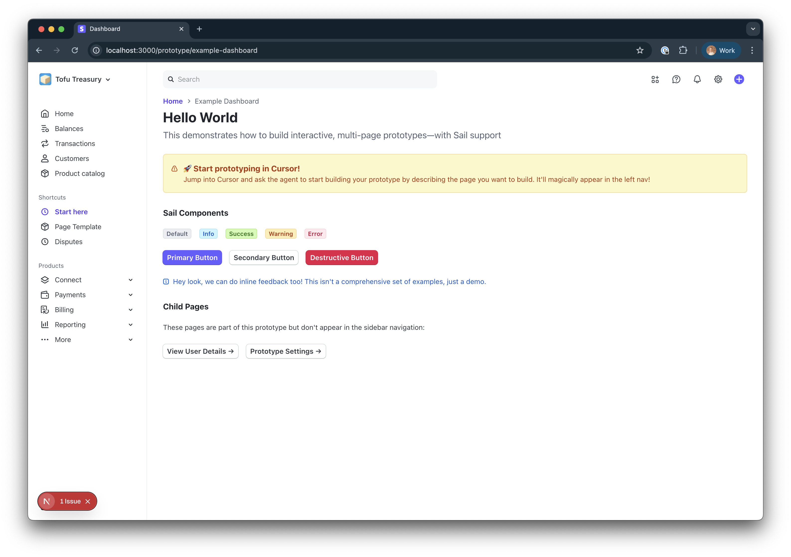

# Stripe Prototyping Dashboard



This project integrates with Stripe's Sail design system to allow quick exploration of realistic experiences inside a dashboard environment, without needing to work inside pay-server. 

You can use real Sail components and tokensx to create interactive dashboard pages with multiple steps, which is great for exploration, testing new ideas, or divergent experimentation.

## Live Demo

🌐 **Live Demo**: [View the live prototype](https://[your-username].github.io/[your-repo-name]/)

## How to use this

This project is intended for use with Cursor's Agent mode—it includes an extensive Cursor rule in `.cursorrules` that helps Cursor understand how to prototype quickly, what Sail components it supports, and how to create pages.

Generally, I recommend starting with a specific prompt that names some of the component types available in Sail, and how you want them arranged on the page. For example:

```
Let's make a Customer Detail page for a customer named "Patrick Collison". This should be the PageHeader for the page, and the sub-header should be their email address. (the page in side nav should be called "Customer Detail" however). 

The page shows the customer's current subscriptions, their payment methods, and a timeline of activity on the customer object, as well as a details section. Each subscription should be to a SaaS prodct, a combination of monthly/annually billed. 
```

Cursor will work on it, and add your new prototype into the left navigation of the dashboard under 'shortcuts' automatically. 

Once you get a working prototype, you'll likely need to tweak it by giving the agent feedback about the right implementation that you're looking for. 

You can see a full version of a working prompt in `design.md`. 

🚨 These Cursor rules are not extensive yet and need improvement that guides how they use Sail's components more explicitly; they are able to help guide it toward a solution, but need tweaking to have stronger POVs about when each type of component is appropriate. Contributions welcome! 

## Getting Started

1. Clone pay-server onto your laptop, inside ~/stripe/ following the instructions [here](https://trailhead.corp.stripe.com/docs/developer-productivity/cloning-pay-server-to-a-laptop).
2. Clone this repository into ~/stripe/ _next to_ pay-server. You need this to grab the Sail components, but won't need to 
3. Run `yarn` in a terminal to install the dependencies.
4. Run `yarn dev` to start the project.
5. Open [http://localhost:3000](http://localhost:3000) with your browser to see the prototyping environment.
6. Open this folder in Cursor, then start prototyping with your Cursor agent!

## Deployment

This project is configured for automatic deployment to GitHub Pages:

- **Automatic Deployment**: Every push to the `main` branch triggers a GitHub Action that builds and deploys the site
- **Static Export**: Uses Next.js static export for optimal GitHub Pages compatibility
- **Live Updates**: Changes are automatically reflected on the live site within minutes

### Manual Deployment

If you need to deploy manually:

```bash
npm run build
# The static files will be in the `out/` directory
```

## Limitations

This is a _hack_ that allows you to use Sail _without_ the overhead of being directly inside pay-server. That comes with benefits—speed and flexibility—and some drawbacks, such as some limitations when using Sail. But, it's a great way to quickly build and test your ideas!

A large chunk of the Sail design system is available in this project, but not _everything_ due to the way Sail is built. Examples of working components include Banners, PageModules, Badges, and much more.

Components relying on legacy Sail implementations, such as Dialog, do not currently work due to their reliance on pay-server's larger infrastructure—a general rule is if it needs `<RootLayer>` it probably won't work.

TODO: A workaround for this that likely satisfies most needs is implementing an emulated version of unsupported components inside this project (e.g this project should just have a local 'Dialog' component that is based on Sail's token system). This is on the list to implement.

## How it works
TODO: describe the different tricks that make this work a bit more; most is configured in `tsconfig.json`.

---

# Manual steps 
You can probably ignore everything below this if you just want to prototype; this is only here if you want to understand how it works. 

## Architecture

### Prototype System

The prototype system automatically discovers and loads prototype components:
- Auto-discovery scans for known prototypes
- Dynamic imports load prototype components on demand
- Fallback handling for missing prototypes
- Subpage support for detailed views

## Creating New Prototypes

1. **Create a new folder** in `src/prototypes/my-prototype/`
2. **Add an index.tsx** file with your main component
3. **Create a config.ts** file (optional - will auto-generate if missing):
   ```tsx
   export const prototypeConfig = {
     name: 'My Prototype',
     description: 'Description of what this prototype does',
     icon: 'product',
     order: 1
   };
   ```
4. **Add subpages** in `subpages/` folder for detailed views
5. Your prototype will automatically appear in the navigation

## Removing Prototypes

To properly remove a prototype you no longer need:

1. **Delete the prototype folder**: Remove the entire `src/prototypes/[prototype-name]/` directory
2. **Update TypeScript declarations**: Remove the corresponding entry from `src/types/prototypes.d.ts` if it exists
3. **Clear browser cache**: If you've visited the prototype recently, you may need to clear your browser cache or hard refresh

**Example:**
```bash
# Remove the prototype folder
rm -rf src/prototypes/my-old-prototype/

# Remove from TypeScript declarations (if it exists)
# Edit src/types/prototypes.d.ts and remove the specific declaration
```

**Note:** The generic module declarations (`@/prototypes/*/index`, etc.) will handle any remaining prototypes automatically, so you only need to remove specific declarations if they exist.

TODO in the future: introduce a user-level import in this file that isn't committed to avoid messes in the core repo.

## Project Structure

- `src/prototypes/` - All prototype components
- `src/components/` - Shared UI components
- `src/contexts/` - React contexts including SailUIContext
- `src/app/` - Next.js app router pages
- `src/types/sail.d.ts` - TypeScript definitions for Sail components
- `src/utils/prototype-discovery.ts` - Auto-discovery system for prototypes# Updated at Thu Jul 24 13:46:51 CDT 2025
# Force rebuild

